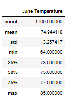

# Surfs_Up_Weather_Analysis_SQLite
Weather Analysis using Python, SQLite,SQLAlchemy,Flask

## Overview & Purpose

This analysis has been performed to understand if it is viable to open a surf and ice-cream shop in Oahu, Hawaii. The weather and the temperature are the determining factors for investors to invest in the Surf n’ Shake shop. The climate_analysis notebook includes analysis on precipitation values during the last year and  the minimum, maximum and average temperatures in the region based on data recorded by the most active station ‘USC00519281’. The app.py file shows the incorporation of Flask into data analysis that would allow the investors to see the results of the python codes in a webpage.

For the challenge part, Oahu temperatures in June and December were compared across a seven year period.

## Results

- The average temperature in June in Oahu is around 75°F and the average temperature in December is slightly lower at 71°F. 
- The maximum temperatures are very similar in June (85°F) and December (83°F).
- The minimum temperatures show high variance in June (64°F) and December (56°F).
- The standard deviations in both June (3.26) and December (3.75) show that the temperatures generally hover around their average although December might have slightly more variations.

      

